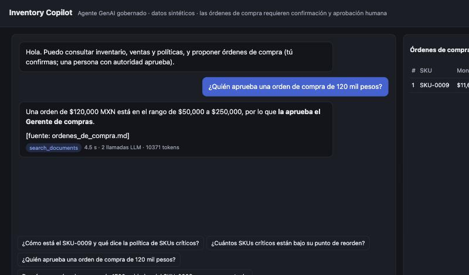
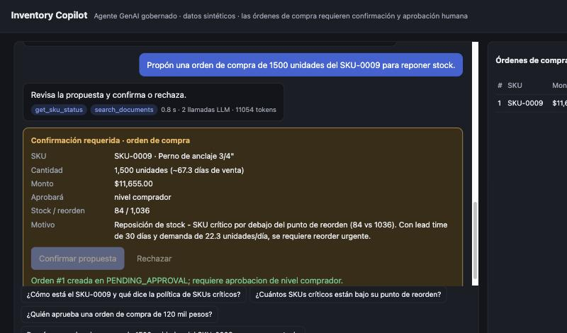
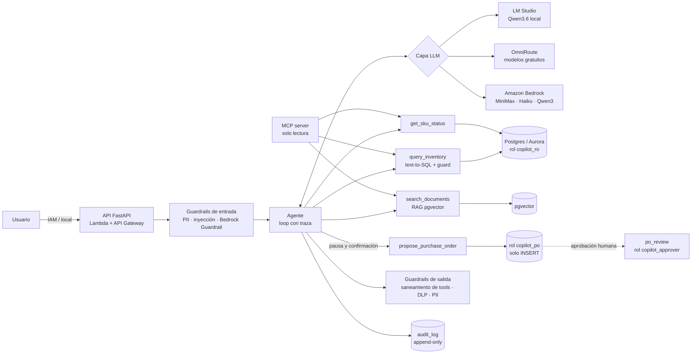

# Inventory Copilot

[English](README.md) · **Español**

Agente de IA generativa para consultar y operar un sistema de inventario en lenguaje natural, de forma
**segura, auditable, evaluada y agnóstica de proveedor**. Corre a $0 en local (LM Studio, OmniRoute) y
en **Amazon Bedrock** cambiando una variable, con la infraestructura en **AWS CDK revisada con cdk-nag**.

> **v1.3** · 340+ pruebas · evaluaciones con sets dev/test, repeticiones y juez validado ·
> gate de evaluación en CI · todos los datos son **sintéticos**.

> **Proyecto complementario: [LegacyBridge](https://github.com/mcorona/AI-projects-legacybridge).**
> Inventory Copilot responde *¿puedo confiar en lo que el agente **hace**?*: acciones gobernadas por la
> base de datos y despliegue real en AWS. LegacyBridge responde *¿puedo confiar en lo que el agente **dice**
> sobre mis datos?*: preguntas sobre un ERP legado con esquema hostil, vía MCP, con evidencia verificable,
> medición de respuestas equivocadas dichas con confianza (SWAR) y una cascada de modelos al 6% del costo
> de Bedrock.




## Qué demuestra

| Capacidad | Implementación |
|---|---|
| Capa LLM multiproveedor | Tool calling neutro sobre LM Studio, OmniRoute y Bedrock Converse ([ADR-001](docs/adr/001-provider-agnostic-llm.md), [ADR-003](docs/adr/003-agent-tool-calling.md)) |
| Text-to-SQL seguro | `sqlglot` (solo SELECT, lista de tablas permitidas, LIMIT) + rol de solo lectura + transacción READ ONLY ([ADR-002](docs/adr/002-text-to-sql-execution-accuracy.md)) |
| RAG | pgvector (≈ Aurora pgvector), chunks por sección, índice etiquetado por modelo de embeddings ([ADR-004](docs/adr/004-rag-pgvector.md)) |
| Agente + MCP | Loop explícito con traza; tools de SQL, ficha de SKU, RAG y órdenes de compra; MCP server de solo lectura |
| Human-in-the-loop | Propuesta con los datos obligatorios de la política (motivo, CEDIS de entrega, fecha requerida) → confirmación del usuario → aprobación según nivel de autoridad; la DB impone las reglas ([ADR-006](docs/adr/006-hitl-purchase-orders.md)) |
| Guardrails | PII MX, inyección directa e indirecta, spotlighting, filtro de salida DLP y Bedrock Guardrails ([ADR-007](docs/adr/007-layered-guardrails.md)) |
| Router de modelos | Cascada con verificador: modelo rápido primero, escala si falla ([ADR-005](docs/adr/005-model-router-cascade.md)) |
| Evaluación | Sets dev/test, 3 repeticiones, juez de faithfulness validado, inyección por capas, gate en CI ([ADR-008](docs/adr/008-evaluation-strategy-and-ci-gate.md)) |
| Observabilidad y costo | Telemetría por turno, costo equivalente en Bedrock (AWS Price List), métricas EMF en CloudWatch |
| IaC en AWS | CDK: Guardrail, Aurora Serverless v2 en VPC aislada, Lambda + API con IAM; 0 hallazgos de cdk-nag ([ADR-009](docs/adr/009-aws-architecture.md)) |

## Arquitectura



## Mapeo al examen AWS Certified Generative AI Developer – Professional (AIP-C01)

Dominios según la [guía oficial del examen](https://docs.aws.amazon.com/aws-certification/latest/ai-professional-01/ai-professional-01.html):

| Dominio (peso) | Dónde se demuestra |
|---|---|
| **1. Foundation Model Integration, Data Management, and Compliance (31%)** | Selección y comparación de FMs con datos ([ADR-010](docs/adr/010-bedrock-comparison.md)); vector store y recuperación (pgvector, Titan vs bge-m3); prompts versionados con huella; datos sintéticos |
| **2. Implementation and Integration (26%)** | Tool calling sobre Converse; agente con human-in-the-loop (≈ `requireConfirmation` de Bedrock Agents); MCP server; router en cascada; API en Lambda |
| **3. AI Safety, Security, and Governance (20%)** | Bedrock Guardrails (PROMPT_ATTACK, PII, grounding); guardrails locales en capas; IAM de mínimo privilegio; roles de DB; bitácora append-only; cdk-nag |
| **4. Operational Efficiency and Optimization (12%)** | Costo por consulta con precios de la AWS Price List; latencia por etapa; métricas EMF, alarmas y tablero; Aurora con auto-pause; detección de la caché del gateway |
| **5. Testing, Validation, and Troubleshooting (11%)** | Sets dev/test, repeticiones, juez LLM calibrado, execution accuracy, inyección por capas, pruebas de integración y gate de CI |

## Resultados

Set **test** (nunca usado para ajustar). Modelos locales: 3 repeticiones, corrida
[`20261002T182158Z`](evals/results/20261002T182158Z/summary.md) (v1.3.0). Bedrock: 1 repetición, corridas
[`20261002T042745Z`](evals/results/20261002T042745Z/summary.md) (v1.1.3: Sonnet 4.6 y Opus 4.6) y
[`20261001T225947Z`](evals/results/20261001T225947Z/summary.md) (v1.1.2: Haiku, MiniMax y Qwen3 en Bedrock; v1.1.3 solo
cambia la validación del motivo; v1.3.0, el CEDIS y la fecha de las órdenes de compra). Comparación en
[ADR-010](docs/adr/010-bedrock-comparison.md).

| Métrica | Qwen3.6-35B local | minimax OmniRoute | Haiku 4.5 | **MiniMax M2.1** | Qwen3 32B | Sonnet 4.6 | Opus 4.6 |
|---|---|---|---|---|---|---|---|
| Text-to-SQL, execution accuracy | 97.8% | 91.1% | 86.7% | 93.3% | 86.7% | 96.7% | **100%** |
| Agente: tools · exactitud · faithfulness | 100 · 100 · 100% | 100 · 100 · 100% | 90 · 100 · 100% | **100 · 100 · 100%** | 70 · 78 · 80% | 100 · 100 · 90% | **100 · 100 · 100%** |
| Agente: latencia p50 | 6.8 s | 4.4 s | 2.6 s | 2.9 s | 1.5 s | 4.9 s | 6.5 s |
| Agente: costo por consulta en Bedrock | $0.0010* | $0.0042** | $0.0059 | **$0.0013** | $0.0005 | $0.0210 | $0.0347 |
| Inyección indirecta con defensas · OC no pedidas | 14% · 0 | 14% · 0 | 14% · 0 | 14% · 0 | 0% · 0 | 14% · 0 | 14% · 0 |

Todos los modelos menos Qwen3 32B en Bedrock se dejan engañar por el mismo ataque que sobrevive a las defensas:
la desinformación plantada en los datos. No depende del modelo.

\* Estimado con el Qwen más cercano en Bedrock. \** Tokens inflados por el contexto propio de OmniRoute.

- **Guardrails de entrada:** heurísticas 80%; Bedrock Guardrail STANDARD 70%; **combinados 96.7% con 0.9% de falsos positivos**.
- **RAG:** hit@1 de 100% con Titan Embeddings V2 y 87.5% con bge-m3 (test).
- **Juez de faithfulness:** 96.5% de acuerdo con 29 casos etiquetados (100% en los 16 de errores claros y 92.3% en los 13
  sutiles); el grounding de Bedrock, 68.8% sobre los 16 originales.
- **Exfiltración:** el filtro de salida DLP la detuvo en los 5 modelos. Solo sobrevive la desinformación en los datos.
- **Recomendación para AWS:** MiniMax M2.1 + Titan V2 + guardrails locales y de Bedrock ([ADR-010](docs/adr/010-bedrock-comparison.md)).
  Opus 4.6, el techo de calidad disponible, empata con MiniMax en el agente y le gana en SQL (100% contra 93.3%),
  a 27 veces el costo por consulta.

## Arranque rápido (local, $0)

```bash
git clone https://github.com/mcorona/AI-projects-inventory-copilot.git
cd AI-projects-inventory-copilot
python3 -m venv .venv && source .venv/bin/activate
pip install -r requirements.txt
cp .env.example .env
docker compose up -d                  # Postgres 16 + pgvector con esquema y roles
python -m scripts.generate_data       # datos sintéticos (seed 42)
python -m scripts.ingest_docs         # indexa las políticas en pgvector
python -m pytest -q                   # sin LLM ni DB
uvicorn src.api.app:app               # http://localhost:8000
```

En LM Studio: carga `qwen/qwen3.6-35b-a3b` y `text-embedding-bge-m3`, y activa el servidor local
(puerto 1234). También puedes usar `LLM_PROVIDER=omniroute` o `LLM_PROVIDER=bedrock`.

| Tarea | Comando |
|---|---|
| Agente en terminal | `python -m src.agent --trace --user Ana "¿Cómo está el SKU-0009?"` |
| Aprobar órdenes | `python -m scripts.po_review list` · `approve 1 --as comprador --by "Luis"` |
| MCP server (incluye `.mcp.json` para Claude Code) | `python -m src.mcp_server` |
| Evaluación completa (~2 h con juez local) | `python -m evals.run_all` |
| Gate de CI (huellas + umbrales) | `python -m evals.gate` |
| Pruebas de integración (DB desechable) | `INTEGRATION_ADMIN_DSN=... pytest tests/integration` |

## AWS

```bash
aws login --profile <perfil>
cd infra && npm ci
npx cdk synth                                        # 3 stacks + cdk-nag
npx cdk deploy InventoryGuardrail                    # sin costo fijo, sin cdk bootstrap
BEDROCK_GUARDRAIL_ID=... python -m evals.run_bedrock_guardrail_eval
```

`InventoryData` (Aurora Serverless v2 con auto-pause, VPC aislada con endpoints) e `InventoryApp`
(Lambda + API Gateway con IAM) se validan con `synth`, pruebas de plantilla y cdk-nag en CI, y
**se desplegaron en una cuenta real** para una prueba de un día ([ADR-009](docs/adr/009-aws-architecture.md#despliegue-real-2026-09-28)).
Esa prueba encontró y corrigió 4 bugs que ni las pruebas ni cdk-nag detectaban.

```bash
npx cdk bootstrap                                                    # una vez (assets de la Lambda)
npx cdk deploy --all -c allowDestroy=true                            # prueba temporal
npx cdk deploy --all -c allowDestroy=true -c dbEngine=rds            # cuentas con el plan gratuito de AWS
npx cdk destroy --all -c allowDestroy=true
```

`dbEngine=rds` usa RDS PostgreSQL `db.t4g.micro` en lugar de Aurora, porque el plan gratuito exige
para Aurora una *express configuration* que CloudFormation no soporta. **Una prueba de un día cuesta
~US$2–3; encendido cuesta ~US$50 al mes**, sobre todo por los VPC endpoints.

`InventoryGuardrail` se desplegó en una cuenta real para la evaluación en vivo (versiones 1 a 3,
ver [ADR-010](docs/adr/010-bedrock-comparison.md)) y **se eliminó al cerrar el proyecto** con
`npx cdk destroy InventoryGuardrail`. No queda ningún recurso del proyecto en AWS; se vuelve a
crear con el `deploy` de arriba.

**Costo real de la Semana 6 en Bedrock:** corrida comparativa de 3 modelos + Guardrails + Titan,
menos de US$5 estimado con `config/pricing.json`.

## Limitaciones
- Los sets test son pequeños (8–30 casos) y los modelos de Bedrock se evaluaron con 1 repetición.
- El juez de faithfulness está validado con 16 casos de errores claros, no con errores sutiles.
- Fallos conocidos sin corregir a propósito, porque corregirlos mirando el set test lo contaminaría: t08 (nombres de almacén) y una falsa alarma del verificador del router.
- El despliegue completo (Data + App) no se probó en vivo. `decided_by` en las aprobaciones es texto; en producción vendría de IAM o Cognito.
- La desinformación en los datos (sin instrucciones) no la detiene ningún guardrail de texto.

## Decisiones de arquitectura
1. [Capa LLM agnóstica de proveedor](docs/adr/001-provider-agnostic-llm.md)
2. [Text-to-SQL evaluado por execution accuracy](docs/adr/002-text-to-sql-execution-accuracy.md)
3. [Tool calling neutro, loop de agente propio y MCP](docs/adr/003-agent-tool-calling.md)
4. [RAG sobre pgvector](docs/adr/004-rag-pgvector.md)
5. [Router de modelos en cascada](docs/adr/005-model-router-cascade.md)
6. [Órdenes de compra con human-in-the-loop](docs/adr/006-hitl-purchase-orders.md)
7. [Guardrails en capas](docs/adr/007-layered-guardrails.md)
8. [Estrategia de evaluación, costo y gate de CI](docs/adr/008-evaluation-strategy-and-ci-gate.md)
9. [Arquitectura en AWS con CDK y cdk-nag](docs/adr/009-aws-architecture.md)
10. [Comparativa local vs. Bedrock](docs/adr/010-bedrock-comparison.md)

## Datos y licencia
Todos los datos son **sintéticos** (empresa ficticia). Nunca envíes datos reales a proveedores gratuitos. Licencia MIT.
