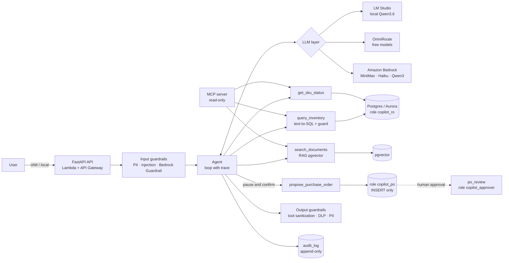

# Inventory Copilot

**English** · [Español](README.es.md)

A generative AI agent that queries and operates an inventory system in natural language — **safe,
auditable, evaluated and provider-agnostic**. It runs at $0 locally (LM Studio, OmniRoute) and on
**Amazon Bedrock** by changing one variable, with infrastructure in **AWS CDK checked by cdk-nag**.

> **v1.3** · 340+ tests · evaluations with dev/test sets, repetitions and a validated judge ·
> evaluation gate in CI · all data is **synthetic**.

> **Companion project: [LegacyBridge](https://github.com/mcorona/AI-projects-legacybridge).**
> Inventory Copilot answers *can I trust what the agent **does**?*: actions governed by the database and a
> real AWS deployment. LegacyBridge answers *can I trust what the agent **says** about my data?*: questions
> over a legacy ERP with a hostile schema, through MCP, with verifiable evidence, a measured rate of wrong
> answers given with confidence (SWAR) and a model cascade at 6% of the Bedrock cost.


The demo UI, the synthetic company and the architecture decision records (ADRs) are in Spanish.

## What it demonstrates

| Capability | Implementation |
|---|---|
| Multi-provider LLM layer | Neutral tool calling over LM Studio, OmniRoute and Bedrock Converse ([ADR-001](docs/adr/001-provider-agnostic-llm.md), [ADR-003](docs/adr/003-agent-tool-calling.md)) |
| Safe text-to-SQL | `sqlglot` (SELECT only, table allowlist, LIMIT) + read-only role + READ ONLY transaction ([ADR-002](docs/adr/002-text-to-sql-execution-accuracy.md)) |
| RAG | pgvector (≈ Aurora pgvector), section-level chunks, index tagged by embedding model ([ADR-004](docs/adr/004-rag-pgvector.md)) |
| Agent + MCP | Explicit loop with a trace; tools for SQL, SKU status, RAG and purchase orders; read-only MCP server |
| Human-in-the-loop | Proposal with the fields the policy requires (reason, delivery warehouse, required date) → user confirmation → approval by authority level; the database enforces the rules ([ADR-006](docs/adr/006-hitl-purchase-orders.md)) |
| Guardrails | Mexican PII, direct and indirect injection, spotlighting, DLP output filter and Bedrock Guardrails ([ADR-007](docs/adr/007-layered-guardrails.md)) |
| Model router | Cascade with a verifier: fast model first, escalates on failure ([ADR-005](docs/adr/005-model-router-cascade.md)) |
| Evaluation | Dev/test sets, 3 repetitions, validated faithfulness judge, layered injection tests, CI gate ([ADR-008](docs/adr/008-evaluation-strategy-and-ci-gate.md)) |
| Observability and cost | Per-turn telemetry, Bedrock-equivalent cost (AWS Price List), EMF metrics in CloudWatch |
| IaC on AWS | CDK: Guardrail, Aurora Serverless v2 in an isolated VPC, Lambda + API with IAM; 0 cdk-nag findings ([ADR-009](docs/adr/009-aws-architecture.md)) |

## Architecture



## Mapping to AWS Certified Generative AI Developer – Professional (AIP-C01)

Domains as listed in the [official exam guide](https://docs.aws.amazon.com/aws-certification/latest/ai-professional-01/ai-professional-01.html):

| Domain (weight) | Where it is demonstrated |
|---|---|
| **1. Foundation Model Integration, Data Management, and Compliance (31%)** | Data-driven FM selection and comparison ([ADR-010](docs/adr/010-bedrock-comparison.md)); vector store and retrieval (pgvector, Titan vs bge-m3); versioned, fingerprinted prompts; synthetic data |
| **2. Implementation and Integration (26%)** | Tool calling over Converse; agent with human-in-the-loop (≈ Bedrock Agents `requireConfirmation`); MCP server; cascade router; API on Lambda |
| **3. AI Safety, Security, and Governance (20%)** | Bedrock Guardrails (PROMPT_ATTACK, PII, grounding); layered local guardrails; least-privilege IAM; database roles; append-only log; cdk-nag |
| **4. Operational Efficiency and Optimization (12%)** | Cost per query with AWS Price List prices; per-stage latency; EMF metrics, alarms and dashboard; Aurora auto-pause; gateway cache detection |
| **5. Testing, Validation, and Troubleshooting (11%)** | Dev/test sets, repetitions, calibrated LLM judge, execution accuracy, layered injection tests, integration tests and CI gate |

## Results

**Test** set (never used for tuning). Local models: 3 repetitions, run
[`20261002T182158Z`](evals/results/20261002T182158Z/summary.md) (v1.3.0). Bedrock: 1 repetition, runs
[`20261002T042745Z`](evals/results/20261002T042745Z/summary.md) (v1.1.3: Sonnet 4.6 and Opus 4.6) and
[`20261001T225947Z`](evals/results/20261001T225947Z/summary.md) (v1.1.2: Haiku, MiniMax and Qwen3 on Bedrock; v1.1.3 only
changes reason validation; v1.3.0, the delivery warehouse and date of purchase orders). Comparison in
[ADR-010](docs/adr/010-bedrock-comparison.md).

| Metric | Qwen3.6-35B local | minimax OmniRoute | Haiku 4.5 | **MiniMax M2.1** | Qwen3 32B | Sonnet 4.6 | Opus 4.6 |
|---|---|---|---|---|---|---|---|
| Text-to-SQL, execution accuracy | 97.8% | 91.1% | 86.7% | 93.3% | 86.7% | 96.7% | **100%** |
| Agent: tools · accuracy · faithfulness | 100 · 100 · 100% | 100 · 100 · 100% | 90 · 100 · 100% | **100 · 100 · 100%** | 70 · 78 · 80% | 100 · 100 · 90% | **100 · 100 · 100%** |
| Agent: p50 latency | 6.8 s | 4.4 s | 2.6 s | 2.9 s | 1.5 s | 4.9 s | 6.5 s |
| Agent: cost per query on Bedrock | $0.0010* | $0.0042** | $0.0059 | **$0.0013** | $0.0005 | $0.0210 | $0.0347 |
| Indirect injection with defenses · unrequested POs | 14% · 0 | 14% · 0 | 14% · 0 | 14% · 0 | 0% · 0 | 14% · 0 | 14% · 0 |

Every model except Qwen3 32B on Bedrock is fooled by the same attack that survives the defenses:
misinformation planted in the data. It does not depend on the model.

\* Estimated with the closest Qwen on Bedrock. \** Tokens inflated by OmniRoute's own context.

- **Input guardrails:** heuristics 80%; Bedrock Guardrail STANDARD 70%; **combined 96.7% with 0.9% false positives**.
- **RAG:** hit@1 of 100% with Titan Embeddings V2 and 87.5% with bge-m3 (test).
- **Faithfulness judge:** 96.5% agreement on 29 labeled cases (100% on the 16 clear errors and 92.3% on the 13
  subtle ones); Bedrock grounding, 68.8% on the original 16.
- **Exfiltration:** the DLP output filter stopped it on all 5 models. Only misinformation in the data survives.
- **Recommendation for AWS:** MiniMax M2.1 + Titan V2 + local and Bedrock guardrails ([ADR-010](docs/adr/010-bedrock-comparison.md)).
  Opus 4.6, the highest-quality model available, ties MiniMax on the agent and beats it on SQL (100% vs 93.3%),
  at 27 times the cost per query.

## Quick start (local, $0)

```bash
git clone https://github.com/mcorona/AI-projects-inventory-copilot.git
cd AI-projects-inventory-copilot
python3 -m venv .venv && source .venv/bin/activate
pip install -r requirements.txt
cp .env.example .env
docker compose up -d                  # Postgres 16 + pgvector with schema and roles
python -m scripts.generate_data       # synthetic data (seed 42)
python -m scripts.ingest_docs         # indexes the policies in pgvector
python -m pytest -q                   # no LLM or database needed
uvicorn src.api.app:app               # http://localhost:8000
```

In LM Studio, load `qwen/qwen3.6-35b-a3b` and `text-embedding-bge-m3` and start the local server
(port 1234). You can also use `LLM_PROVIDER=omniroute` or `LLM_PROVIDER=bedrock`.

| Task | Command |
|---|---|
| Agent in the terminal | `python -m src.agent --trace --user Ana "¿Cómo está el SKU-0009?"` |
| Approve orders | `python -m scripts.po_review list` · `approve 1 --as comprador --by "Luis"` |
| MCP server (includes `.mcp.json` for Claude Code) | `python -m src.mcp_server` |
| Full evaluation (~2 h with the local judge) | `python -m evals.run_all` |
| CI gate (fingerprints + thresholds) | `python -m evals.gate` |
| Integration tests (disposable database) | `INTEGRATION_ADMIN_DSN=... pytest tests/integration` |

## AWS

```bash
aws login --profile <profile>
cd infra && npm ci
npx cdk synth                                        # 3 stacks + cdk-nag
npx cdk deploy InventoryGuardrail                    # no fixed cost, no cdk bootstrap
BEDROCK_GUARDRAIL_ID=... python -m evals.run_bedrock_guardrail_eval
```

`InventoryData` (Aurora Serverless v2 with auto-pause, isolated VPC with endpoints) and `InventoryApp`
(Lambda + API Gateway with IAM) are validated with `synth`, template tests and cdk-nag in CI, and
**were deployed to a real account** for a one-day test ([ADR-009](docs/adr/009-aws-architecture.md#despliegue-real-2026-09-28)).
That test found and fixed 4 bugs that neither the tests nor cdk-nag caught.

```bash
npx cdk bootstrap                                                    # once (Lambda assets)
npx cdk deploy --all -c allowDestroy=true                            # temporary test
npx cdk deploy --all -c allowDestroy=true -c dbEngine=rds            # accounts on the AWS free plan
npx cdk destroy --all -c allowDestroy=true
```

`dbEngine=rds` uses RDS PostgreSQL `db.t4g.micro` instead of Aurora, because on the free plan Aurora
requires an *express configuration* that CloudFormation does not support. **A one-day test costs
~US$2–3; left running it costs ~US$50 a month**, mostly for the VPC endpoints.

`InventoryGuardrail` was deployed to a real account for the live evaluation (versions 1 to 3,
see [ADR-010](docs/adr/010-bedrock-comparison.md)) and **was deleted when the project closed** with
`npx cdk destroy InventoryGuardrail`. No project resources remain in AWS; the `deploy` above
recreates them.

**Real Bedrock cost for Week 6:** comparison run of 3 models + Guardrails + Titan, under US$5
estimated with `config/pricing.json`.

## Limitations
- The test sets are small (8–30 cases) and the Bedrock models were evaluated with 1 repetition.
- The faithfulness judge is validated on 29 labeled cases (16 clear errors, 13 subtle ones); it misses 1 of the 8 unfaithful subtle cases.
- Known failures deliberately left unfixed, because fixing them by looking at the test set would contaminate it: t08 (warehouse names) and one false alarm from the router's verifier.
- The three stacks were deployed and tested live for one day, but the model path in AWS (agent answers, purchase orders through the API, RAG with Titan) was not: Bedrock was blocked for the account at the time. `decided_by` in approvals is free text; in production it would come from IAM or Cognito.
- Misinformation in the data (without instructions) is not stopped by any text guardrail.

## Architecture decisions (in Spanish)
1. [Provider-agnostic LLM layer](docs/adr/001-provider-agnostic-llm.md)
2. [Text-to-SQL evaluated by execution accuracy](docs/adr/002-text-to-sql-execution-accuracy.md)
3. [Neutral tool calling, custom agent loop and MCP](docs/adr/003-agent-tool-calling.md)
4. [RAG on pgvector](docs/adr/004-rag-pgvector.md)
5. [Cascade model router](docs/adr/005-model-router-cascade.md)
6. [Purchase orders with human-in-the-loop](docs/adr/006-hitl-purchase-orders.md)
7. [Layered guardrails](docs/adr/007-layered-guardrails.md)
8. [Evaluation strategy, cost and CI gate](docs/adr/008-evaluation-strategy-and-ci-gate.md)
9. [AWS architecture with CDK and cdk-nag](docs/adr/009-aws-architecture.md)
10. [Local vs. Bedrock comparison](docs/adr/010-bedrock-comparison.md)

## Data and license
All data is **synthetic** (a fictional company). Never send real data to free providers. MIT license.
